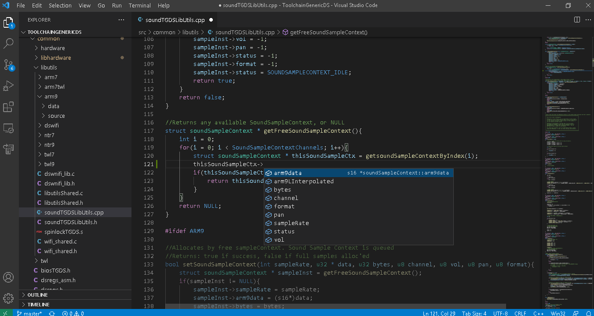

VSCode IDE + TGDS Support:

Features:

- C++ IDE with Intellisense support 
- Real time trace-ability of TGDS components (either Toolchain or the TGDS project) such as include-function SDK methods scope, documentation
- STDLIB/Newlib C++ resolve symbols in real time

Setup:

[Windows]
You must compile newlib-nds first:
https://bitbucket.org/Coto88/newlib-nds

Once installed you should have MSYS2 available (required)

Download & Install latest VSCode 
Then install these extensions (Extensions block icon):
- C/C++
- C/C++ Extension Pack
- C++ Intellisense
- Arm Assembly

Open VSCode -> File -> Preferences -> Settings -> Open Settings (JSON). Clean the entire JSON and copy/paste the below script:

{ 
    "terminal.integrated.profiles.windows": { 
        "msys2": { 
            "path": "C:\\MinGW\\msys\\1.0\\msys.bat", 
            "args": [] 
        } 
    }, 
    "terminal.external.windowsExec": "C:\\MinGW\\msys\\1.0\\msys.bat", 
	"terminal.explorerKind": "external", 
	"C_Cpp.updateChannel": "Insiders" 
}

Then File -> Save, then close. 

Up to this point we're done, and from now on just follow the [Usage] instructions to load TGDS Apps in the IDE.

[Usage]
- Explorer -> Open Folder: Choose either TGDS or TGDS Project base folder and it should open.
- To compile TGDS / TGDS Projects and generate TGDS Apps click: 
  -> Terminal
  and a new msys2 terminal should open. You can now do the usual steps to build a TGDS Project: "cd <PathToTGDSProject>", then "make clean", then "make".

Todo:
- Linux support
- Full source level debugging Remote GDB (real hardware and emulator) implemented and integrated in the IDE first, 
and while I do have Remote GDB enabled in TGDS projects, a severe rewrite of TGDS pieces is actually required in order to hook the debugger into the same MSYS2 console 
pipeline, which would enable both TGDS building and hooking a process to it in the same action.
