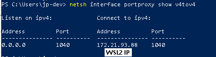

VSCode IDE + TGDS Support:

OS Support: 
	- WSL2 Ubuntu 20.04+ on Windows 10 *only*

Features:
	- C++ IDE with Intellisense support 
	- Enables full-debugging capabilities by using VSCode. Includes building TGDS Projects from VSCode by just pressing F5. 

[Warning]
	If you already have Ubuntu on WSL2, use another distro to set up TGDS, otherwise you'll lose your distro and environment!
	
Setup:

1) Open PowerShell as Administrator then write: 
	- Set-ExecutionPolicy RemoteSigned
	- wsl.exe --update
	- wsl --unregister Ubuntu (or any other distro)
	- wsl --install -d Ubuntu (or any other distro)

2) Download & Install the bundled VSCode in the /bin folder

3) Open VSCode, go to Extensions block icon, and install the following extensions:
- C/C++
- C/C++ Extension Pack
- C++ Intellisense
- Arm Assembly
- WSL

4)Close VSCode, then open PowerShell and write
	-wsl -d Ubuntu

Shell should be @ Ubuntu Virtual Machine now, now write the following commands:
	-cd ~
	-code .

Note: If you aren't getting a "Trust the authors" pop-up (and clicking trust always checkbox), retry 4) until you get the pop up.

5) Once VSCode is connected to WSL:<Linux distro>, you'll need to go to Remote Explorer icon, choose WSL Target: /home/{linux-id-user}/
	Right-click on "Connect in Current Window".
	
   Open ~/.bashrc file in current directory, at the end, press <enter> and add the following string:
   export GCC_COLORS='error=01;31:warning=01;35:note=01;36:caret=01;32:locus=01:quote=01'
   Close local ~/.bashrc in current directory, save changes. Reboot Windows (yes, the entire system), then proceed to 4), except this step, and continue.
   
6) Create a "new folder", and copy the default Makefile provided in this repo inside that folder. Then Right-click button on "new folder", and select "Open in Integrated Terminal"

7) Write in the terminal the following commands:
	-sudo apt-get install make
	-make checkoutenvironment
	-make newlib
	-make toolchaingenericds
	-make checkoutall (this is optional, just retrieves all TGDS Projects from GIT into your environment)
	
Up to this point we're done, and from now on just follow the [Usage] instructions to compile & debug natively TGDS Apps in the IDE.

[Usage]
1) Open PowerShell and write
	-wsl -d Ubuntu (or any other distro)
	-exit

2) Don't close PowerShell, and execute IN ORDER, the following script in this repo. Required for NDS Wifi to see WSL network.
	-WSL2.cmd (right-click mouse button "Run as administrator")
	-code .
	-netsh interface portproxy show v4tov4 (you should see 1040 port mapped to localhost)
	
	-exit
	
3) On VSCode, Go to Remote Explorer icon, choose WSL Target: /home/{linux-id-user}/
	Right-click on "Connect in Current Window"

4) On VSCode, go back to Explorer icon, Right-click button on "new folder", and select "Open in Integrated Terminal", assumming you want to assemble ToolchainGenericDS-template NDS/TWL binary.
	-git clone https://Coto88@bitbucket.org/Coto88/toolchaingenericds-template.git
	-cd toolchaingenericds-template
	-make clean
	-make

Note:
If you want to assemble again newlib-nds and ToolchainGenericDS, go to 7) (except "-make checkoutall" step ) until here.

[Remote debugging on NTR/TWL hardware]
	Work in progress, see: https://bitbucket.org/Coto88/toolchaingenericds-ide/issues/1/implement-gdb-remote-debugger